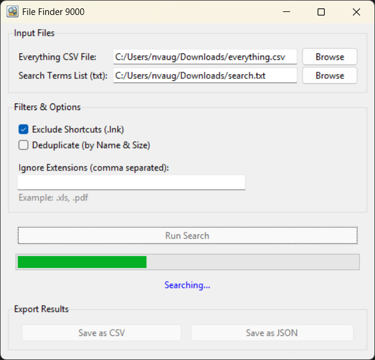

# FileFinder9000

[](https://github.com/astral-sh/ruff)
[](https://github.com/pre-commit/pre-commit)
[](https://github.com/NathanVaughn/FileFinder9000/blob/main/LICENSE)

---

This is a simple tool to take a `.csv` export from
[Everything](https://www.voidtools.com/) and bulk search various terms. This tool
will return a `.json` or `.csv` file of the results. By using `.csv` files
from Everything, the Everything SDK does not need to be installed.

This tool is useful if you have a list of old documents you are trying
to locate on a file server or something.



## Development

Use the provided [devcontainer](https://containers.dev/)
or run the following for local development:

```bash
# Install uv
# https://docs.astral.sh/uv/getting-started/installation/
uv tool install vscode-task-runner
vtr install
```
